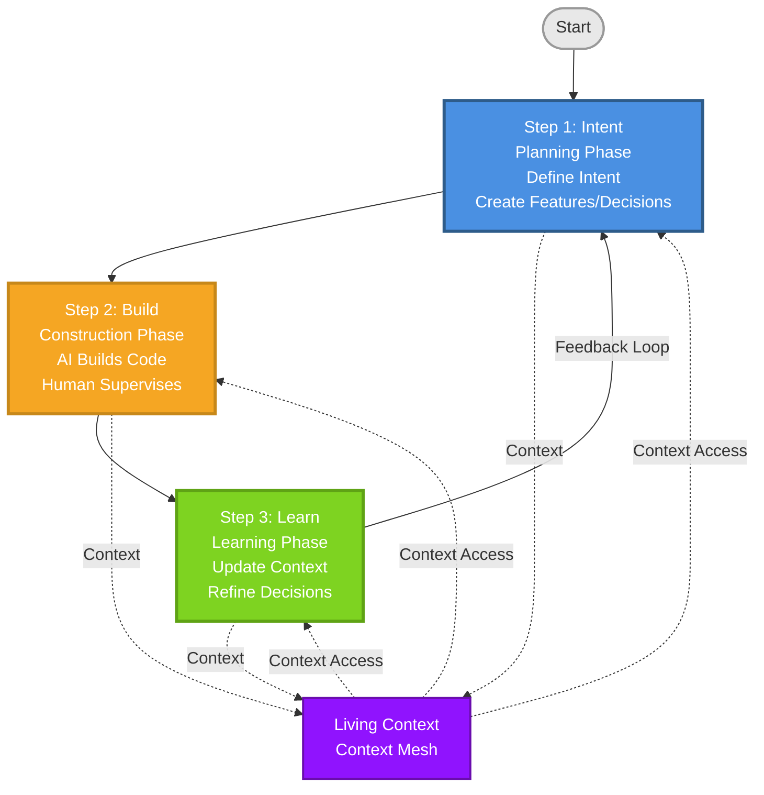
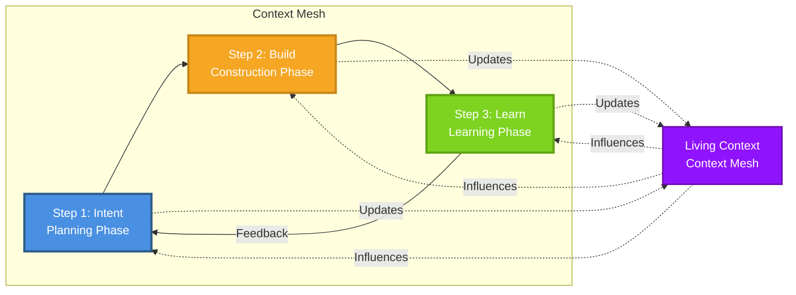

# Context Mesh Framework Diagram

## Mermaid Diagram (for rendering)

## Circular Flow Diagram (Alternative)

## Description for Image Generation

If you want to create a visual diagram similar to the original circular design, here's a detailed description:

### Circular Diagram Layout

**Center Core:**
- Text: "Context Mesh"
- Subtitle: "Living Context"
- Thin gray ring around the center

**Three Main Steps (arranged in a circle, clockwise):**

1. **Step 1: Intent** (Blue/Teal segment)
   - Position: Top-left to top
   - Text: "Intent"
   - Subtitle: "Planning Phase"
   - Description: "Define Intent, Create Features/Decisions"
   - Arrow pointing clockwise to next step

2. **Step 2: Build** (Orange segment)
   - Position: Top-right to bottom-right
   - Text: "Build"
   - Subtitle: "Construction Phase"
   - Description: "AI Builds Code, Human Supervises"
   - Arrow pointing clockwise to next step

3. **Step 3: Learn** (Green segment)
   - Position: Bottom-left to top-left
   - Text: "Learn"
   - Subtitle: "Learning Phase"
   - Description: "Update Context, Refine Decisions"
   - Arrow pointing back to Step 1 (feedback loop)

**Connections:**
- Small arrows from center "Living Context" pointing outward to each step
- Feedback arrow from Step 3 back to Step 1 (completing the cycle)
- Each step connected to the next with arrows

**Color Scheme:**
- Intent: Blue/Teal (#4A90E2)
- Build: Orange (#F5A623)
- Learn: Green (#7ED321)
- Center: Purple/Dark Blue (#9013FE)
- Background: Light gray/white

## Tools to Generate the Image

You can use these tools to create the image:

1. **Mermaid Live Editor**: https://mermaid.live/
   - Paste the Mermaid code above
   - Export as PNG/SVG

2. **Draw.io / diagrams.net**: https://app.diagrams.net/
   - Create circular diagram manually
   - Use the description above as reference

3. **Figma / Canva**: 
   - Create custom circular diagram
   - Use the color scheme and layout described

4. **AI Image Generators** (DALL-E, Midjourney, etc.):
   - Use the description above as prompt
   - Request: "Circular diagram with 3 segments..."

## Recommended Approach

I recommend using **Mermaid Live Editor** (https://mermaid.live/) because:
- It's free and easy to use
- The code is already provided above
- You can export as PNG/SVG
- It matches the style of technical documentation

