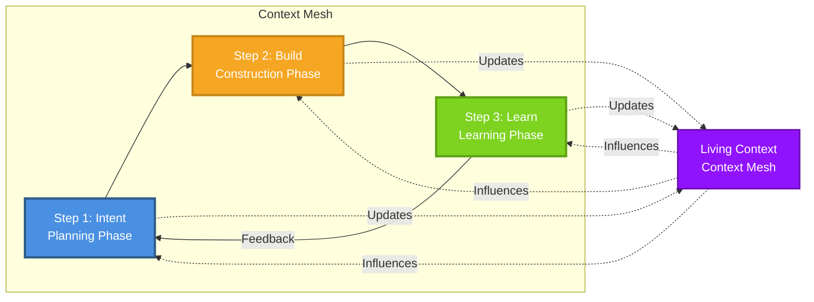

# Context Mesh - Framework Structure

## Framework Overview

Context Mesh is an AI-First development framework that implements the 5 Philosophical Principles of AI-First Development. Context Mesh treats context as the primary creation, with code as its manifestation, enabling sustainable AI-assisted development.

**Context Mesh is not a replacement for Scrum or Agile** - it's a complementary framework specifically designed for AI-First development that can be used alongside existing methodologies.

## Using AI as Your Assistant

Context Mesh works with AI tools (Cursor, GitHub Copilot, etc.) as assistants:

- **Step 1 (Intent)**: Use AI to help structure and refine your intent
- **Step 2 (Build)**: Use AI to generate code based on your context
- **Step 3 (Learn)**: Use AI to help identify changes and update context

You maintain control - AI assists, you decide.

## Definition of Done (DoD)

Each step in Context Mesh has a **Definition of Done** - a clear checklist that ensures the step is complete and context is preserved.

**Why DoD matters:**
- Ensures context is never lost
- Makes it clear when a step is complete
- Helps maintain quality and consistency
- Enables team alignment

**The 3 Core Artifacts:**
1. **Intent** - What and why (Step 1)
2. **Decisions** - How and why we chose (can be created in any step, recommended in Step 1)
3. **Learnings** - What we learned (Step 3)

Each step's DoD ensures these artifacts are created and maintained.

## Context Structure

Context Mesh uses a simple directory structure to organize context:

```
context/
├── intent/          # Step 1: Intent statements
│   ├── project-intent.md
│   ├── feature-*.md
│   ├── bug-*.md
│   └── refactor-*.md
│
├── decisions/       # Decisions (can be created in any step, recommended in Step 1)
│   └── 001-*.md, 002-*.md, ...
│
├── knowledge/       # Patterns, anti-patterns (all steps)
│   ├── patterns/
│   └── anti-patterns/
│
└── evolution/       # Step 3: Changelogs, learnings
    ├── changelog.md
    └── learning-*.md
```

**Why this structure:**
- Simple and clear organization
- Easy to navigate and maintain
- Works with any tools (or no tools)
- Flexible - add subdirectories as needed

---

## AGENTS.md Integration

Context Mesh works seamlessly with the **[AGENTS.md](https://agents.md/)** standard, an open format used by over 20,000 open-source projects to guide AI coding agents.

### How They Work Together

**AGENTS.md** acts as a **router** that uses **Context Mesh** as the central knowledge hub:

- **AGENTS.md** = Operational instructions (how to work in the project)
  - Setup commands
  - Development workflow
  - Code style and conventions
  - Testing instructions
  - Project structure

- **Context Mesh** = Strategic context (what to build and why)
  - Intent (what and why)
  - Decisions (how and why we chose)
  - Knowledge (patterns, learnings)

**Together**: AGENTS.md routes AI agents to the right Context Mesh files, providing both operational guidance and strategic context.

### Recommended Structure

```
project/
├── AGENTS.md          # Router: operational instructions + references to Context Mesh
├── context/           # Context Mesh: strategic context (intent, decisions, knowledge)
│   ├── intent/
│   ├── decisions/
│   └── knowledge/
└── agents/            # Optional: specialized agent definitions (see ADVANCED.md)
    └── agent-*.md
```

### AGENTS.md References Context Mesh

Your `AGENTS.md` should reference Context Mesh files:

```markdown
## Context Files to Load

When working on this project, AI agents should load:

- @context/intent/project-intent.md (overall project goals)
- @context/decisions/001-tech-stack.md (technology choices)
- @context/decisions/002-database.md (database design)
- @context/knowledge/patterns/*.md (coding patterns)
```

This way, AGENTS.md provides the **operational how-to**, while Context Mesh provides the **strategic why and what**.

### Benefits

- ✅ **Widely Adopted**: AGENTS.md is used by 20k+ projects
- ✅ **Complementary**: AGENTS.md (operational) + Context Mesh (strategic)
- ✅ **Router Pattern**: AGENTS.md routes to Context Mesh files
- ✅ **AI-Friendly**: Both formats are designed for AI agents
- ✅ **Flexible**: Use AGENTS.md alone, Context Mesh alone, or both together

**Note**: AGENTS.md is **optional** but **recommended** for better AI agent experience. Context Mesh works perfectly without it, but together they provide complete guidance.

See [TOOLS.md](TOOLS.md) for more details on AGENTS.md integration.

---

## The 3-Step Context Mesh Workflow

Context Mesh is designed for simplicity and easy adoption, similar to Scrum. The framework consists of three essential steps that preserve context throughout the development lifecycle:

```
┌─────────────┐
│   INTENT    │ ← Define intent + create living context
└──────┬──────┘
       │
       ↓
┌─────────────┐
│    BUILD    │ ← AI builds + human supervises + context evolves
└──────┬──────┘
       │
       ↓
┌─────────────┐
│    LEARN    │ ← Learn + update context + refine intent
└──────┬──────┘
       │
       └──────→ (feedback loop)
                └──────→ INTENT (refined)
```

---

### Step 1: Intent

**Purpose**: Plan and prepare context before building. This is the **planning phase** where you define what to build, create feature intents, make technical decisions, and prepare everything needed for efficient Build phase.

**What it does**: 
- Defines what you want to build and why
- Creates feature/bug/refactoring intents
- Makes technical decisions (recommended to plan here)
- Creates initial living context
- Identifies or defines initial patterns (for existing/new projects)

**Intent can be:**
- **Initial** (quick start): Basic intent, refine as you learn
- **Refined** (pre-planned): Detailed intent after team discussion

**Both approaches are valid** - choose based on your project needs.

**Activities**:
- **Define Intent** (what and why):
  - Create `project-intent.md` for overall project scope
  - Create `feature-*.md` for each new feature
  - Create `bug-*.md` for each bug fix
  - Create `refactor-*.md` for refactoring work
  - Can start minimal: basic description (e.g., "Weather application")
  - Use AI to help expand and structure intent
  - Use prompts to generate context from minimal input

- **Create Decisions** (recommended in Step 1):
  - **Best Practice**: Create technical decisions in Step 1 when you know the approach
  - Plan decisions before Build for faster implementation
  - Decisions can be created in any step, but planning in Step 1 makes Build more efficient
  - Create `decisions/*.md` files for significant technical choices
  - Can create comprehensive context in Step 1 (faster Build phase)
  - Or start minimal and expand as needed (more iterative)

- **Create Initial Context**:
  - AI can help generate context structure
  - Review and refine AI-generated context
  - Use Plan, Approve, Execute pattern (see below)

- **Identify or Define Initial Patterns**:
  - **For existing projects**: Identify existing patterns in codebase
  - **For new projects**: Define initial patterns based on team experience
  - Store in `context/knowledge/patterns/`

- **Align Stakeholders**:
  - Ensure everyone understands the intent
  - Validate decisions with team if needed

**Human Role**:
- Lead intent capture
- Validate intent clarity
- Approve initial context

**AI Role**:
- Assist in structuring intent
- Suggest context organization
- Analyze similar projects for insights
- Generate context from prompts (when asked)
- Explain what it will create before executing (Plan, Approve, Execute)

**Outputs**:
- Clear Intent Statement (`project-intent.md` or `feature-*.md`/`bug-*.md`)
- Technical Decisions (if planned) - `decisions/*.md`
- Initial Living Context
- Initial Patterns (if identified or defined)

**Definition of Done**:
- [ ] Intent statement is clear and validated (What + Why) - **Required**
- [ ] Feature/Bug/Refactor intent created (if applicable) - **Required**
- [ ] Technical decisions created (if known) - **Recommended** (makes Build faster)
- [ ] Initial context created and stored
- [ ] Initial patterns identified (existing projects) or defined (new projects) - **Optional**
- [ ] Stakeholders aligned on intent

**Principles Applied**:
- ✅ **Context as Primary Creation** - Context is created first
- ✅ **Intent-Driven Architecture** - Intent guides everything

---

### Step 2: Build

**Purpose**: **Construction phase** - AI builds code with context, human supervises, and decisions are documented or updated as needed.

**Prerequisites** (from Step 1):
- ✅ Intent Statement (What + Why) - **Required** (`feature-*.md`, `bug-*.md`, or `project-intent.md`)
- ✅ Technical Decisions (if planned in Step 1) - **Recommended** (makes Build faster)
- ✅ Initial patterns (if known) - **Optional, can identify during Build**

**Note**: Decisions can be created or updated in any step:
- **Step 1 (Intent)**: Plan decisions (approach, strategy) - **Recommended** for faster Build
- **Step 2 (Build)**: Create or update decisions if technical choices emerge during implementation
- **Step 3 (Learn)**: Update decisions with outcomes or create improvement decisions

**Flexibility**: If you planned decisions in Step 1, you can still create new decisions or update existing ones in Step 2 if you discover better approaches or new technical choices during implementation.

**What it does**:
- AI generates code using living context (intent, decisions, patterns/anti-patterns)
- Human supervises and validates
- Decisions are created or updated in context (if not planned in Step 1, or if better approaches are discovered)
- Context is continuously updated
- Follows established patterns, avoids known anti-patterns
- Can create new decisions if technical choices emerge during implementation

**Activities**:
- Plan before building:
  - Load necessary context files (selective loading for focus)
  - Ask AI to explain what it will build and how
  - Review AI's planning approach
- Approve before executing:
  - Review and approve plan (or request changes)
  - AI executes only with your approval
- Execute with context:
  - AI generates code based on approved plan
  - Can generate everything at once or part by part
  - Human supervises and validates AI work
- Create or update implementation decisions:
  - Use decisions from Step 1 if they exist (recommended approach)
  - Create new decisions if technical choices emerge during Build
  - Update existing decisions if implementation approach differs from plan

### Writing Prompts for AI Code Generation

**Context Mesh Philosophy**: Since **context is the primary artifact**, prompts should be **simple and reference the context**. The context files contain all the details (tech stack, patterns, anti-patterns, requirements, decisions).

### Approach Hierarchy for Code Generation

Context Mesh offers three approaches for generating code with AI, in order of recommendation:

#### 1. ✅ Simple Prompts (Recommended - Default)

**Use when**: Context is sufficient for the task

**Example**:
```
Implement authentication following @context/intent/feature-user-auth.md
and @context/decisions/002-auth-approach.md
```

**Advantages**:
- ✅ Context is primary (Context Mesh philosophy)
- ✅ Less maintenance (update context, not prompts)
- ✅ Single source of truth
- ✅ More reliable (AI reads complete context)
- ✅ Aligned with framework philosophy

**When to use**: Always when possible. This is the recommended default approach.

---

#### 2. ✅ AI Agents (agent-*.md) (Advanced - When Needed)

**Use when**: Need structured/reusable execution, or working with a team

**Example**:
```
Execute @agents/agent-backend.md for payment feature
```

**Advantages**:
- ✅ Reusable (same pattern for multiple features)
- ✅ Modular (execute specific parts)
- ✅ Structured (DoD, conventions, scope)
- ✅ Complements Context Mesh (execution + context)
- ✅ Ideal for teams (shared patterns)

**When to use**:
- Complex projects with multiple features
- Teams working together
- Reusable execution patterns
- When you need structure beyond context

**See**: [ADVANCED.md](ADVANCED.md) for details on agent files.

---

#### 3. ⚠️ Detailed Prompts (Avoid - Temporary Only)

**Use when**: Testing, temporary override, or initial learning

**Example** (not recommended):
```
Create auth service layer (services/auth.service.ts),
create auth routes (routes/auth.routes.ts) with signup, login, logout,
implement JWT middleware, create DTOs with validation...
```

**Disadvantages**:
- ❌ Duplicates information from context
- ❌ Hard to maintain (changes in two places)
- ❌ Goes against philosophy (context is not primary)
- ❌ Less reliable (AI may not read complete context)

**When to use**:
- Only temporarily for testing
- Temporary override of context
- Initial learning (then migrate to simple prompts)

**Recommendation**: If you need detailed prompts frequently, consider creating an `agent-*.md` file instead.

---

### Decision: Which Approach to Use?

| Situation | Recommended Approach | Why |
|-----------|---------------------|-----|
| Simple project, single feature | **Simple Prompts** | Context is sufficient |
| Complex project, multiple features | **AI Agents (agent-*.md)** | Structured and reusable execution |
| Team collaboration | **AI Agents (agent-*.md)** | Shared patterns |
| Temporary test, override | **Detailed Prompt** | Acceptable, but temporary |
| Initial learning | **Simple Prompts** | Start simple |

### Practical Examples

**Example 1 - Simple Prompt (Recommended):**
```
Create the project structure following @context/decisions/001-tech-stack.md
and @context/decisions/003-database-schema.md
```

**Example 2 - Agent File (Advanced):**
```
Execute @agents/agent-backend.md for authentication feature
```

**Example 3 - Detailed Prompt (Avoid):**
```
Create backend/ folder with Express + TypeScript + Prisma setup,
frontend/ folder with React + TypeScript + Vite setup,
following the tech stack decision in @context/decisions/001-tech-stack.md...
```
*This example repeats what's already in context. Use Example 1 instead.*

### Final Recommendation

1. **Start with Simple Prompts** - This is the default approach
2. **Add AI Agents (agent-*.md)** - When you need structure or reusability
3. **Avoid Detailed Prompts** - Use only temporarily, or create an agent file

**Remember**: Context is primary. If you're writing long prompts, consider adding that information to context or creating an agent file.
- Follow established patterns from knowledge/ (if available)
- Avoid known anti-patterns from knowledge/ (if available)
- Identify new patterns during implementation (optional)
- Update context continuously
- Review code quality
- Validate against intent

**Context Artifacts**:
- Implementation Code (with context links)
- Decision Records (why decisions were made)
- Build Context Updates
- Code-Context Mapping

**Human Role**:
- Supervise AI execution
- Validate code quality
- Approve implementation decisions
- Review context updates
- Make critical decisions

**AI Role**:
- Explain planning approach before generating code
- Generate code based on context (after approval)
- Suggest technical solutions
- Review code for context alignment
- Propose improvements

**Outputs**:
- Implemented Code (context-linked)
- Decision Records
- Updated Living Context
- Implementation Documentation
- New Patterns Identified (optional)

**Definition of Done**:
- [ ] Code implemented using context
- [ ] Important decisions documented (with rationale)
- [ ] Code linked to context (intent, decisions)
- [ ] Human review completed
- [ ] Context updated with implementation details
- [ ] Code validated against intent

**Principles Applied**:
- ✅ **Human-AI Collaborative Consciousness** - Explicit collaboration
- ✅ **Contextual Decision Architecture** - Decisions with context
- ✅ **Knowledge as Living Entity** - Context evolves continuously

---

### Step 3: Learn

**Purpose**: **Learning phase** - Update living context to reflect code changes, document learnings, and refine decisions and intent based on outcomes.

**What it does**:
- Updates context to reflect actual code changes
- Documents learnings from development process
- Updates decisions with outcomes (what actually happened)
- Creates or updates improvement decisions if needed
- Refines intent if needed
- Creates feedback loop to Intent

**Activities**:
1. **Update Context** (Primary):
   - Plan: Ask AI to identify what changed
   - Approve: Review AI's analysis of changes
   - Execute: Update context with your approval
   - Use AI to help identify what changed
   - Update context to match current codebase
   - Update decision records with outcomes (what actually happened)
   - Create new improvement decisions if learnings suggest better approaches
   - Update changelog with significant changes

2. **Preserve Knowledge** (Important):
   - Preserve patterns identified during Build
   - Update patterns based on learnings
   - Document new anti-patterns discovered
   - Preserve context around patterns/anti-patterns

3. **Document Learnings** (Optional):
   - Note what worked well
   - Document challenges or discoveries

4. **Refine Intent** (If needed):
   - Adjust intent based on learnings
   - Create new work items if needed

**Context Artifacts**:
- Updated Context (reflecting code changes)
- Updated Decision Records (with outcomes from implementation)
- New Improvement Decisions (if learnings suggest better approaches)
- Changelog entries (documenting what changed)
- Learning Notes (optional)
- Preserved Patterns (if identified during Build)
- Refined Intent (if needed)

**Human Role**:
- Review code changes
- Decide what needs context updates
- Update context (with AI assistance)
- Validate context accuracy

**AI Role**:
- Explain what changed before updating context (Plan, Approve, Execute)
- Help identify what changed in code
- Suggest what needs updating in context
- Assist in updating documentation
- Propose context improvements

**Outputs**:
- Updated Living Context
- Updated Decision Records (if applicable)
- Updated Changelog
- Preserved/Updated Patterns (if applicable)
- Learning Notes (optional)
- Refined Intent (if needed)

**Definition of Done**:
- [ ] Context updated to reflect code changes
- [ ] Context aligned with current codebase
- [ ] Changelog updated with significant changes
- [ ] Patterns preserved/updated in knowledge/ (if applicable)
- [ ] Decision records updated if outcomes differ (optional)
- [ ] Learnings documented (optional)
- [ ] Intent refined if needed (optional)

**Principles Applied**:
- ✅ **Knowledge as Living Entity** - Knowledge evolves
- ✅ **Context as Primary Creation** - Context is updated
- ✅ **Intent-Driven Architecture** - Intent is refined

---

## Feedback Loop

### Primary Feedback Loop: Learn → Intent

**Mechanism**: Insights from Step 3 (Learn) feed directly back to Step 1 (Intent)

**Refinement happens:**
- **Before Step 1**: Team refines intent before starting (optional)
- **After Step 3**: Refine intent based on learnings (feedback loop)
- **Result**: Refined intent feeds back to Step 1 for next cycle

**Flow**:
1. Learnings from results → Intent refinement
2. Outcome analysis → Intent refinement
3. Context evolution → Enhanced intent
4. Updated decisions → Better future decisions
5. Patterns preserved → Better future implementations

**Context Updates**:
- Living context automatically evolves
- Intent statements refined
- Decision records updated with outcomes
- Patterns updated with learnings
- Changelog updated
- New work items created from learnings

---

## Living Context

Living Context is the central knowledge repository that:

- **Stores**: Intent, decisions, implementation details, learnings, patterns, anti-patterns
- **Evolves**: Continuously updates as system changes
- **Traces**: Full traceability from intent to code to outcomes
- **Connects**: Links intent → decisions → code → learnings
- **Preserves**: Patterns and anti-patterns with their context

**Key Characteristics**:
- Always up-to-date
- Versioned (using Git or similar)
- Searchable and queryable
- Linked relationships between artifacts

**How to Maintain**:
- Update context during Build step
- Update context during Learn step
- Keep context simple and focused
- Link everything to intent
- Preserve patterns and anti-patterns in knowledge/

---

## Patterns & Anti-patterns

Patterns and anti-patterns are knowledge that evolves with the system and guide development.

**When Patterns are Established**:

**For New Projects** (Step 1: Intent):
- Define initial patterns based on team experience or best practices
- Start with minimal set, evolve as you learn

**For Existing Projects** (Step 1: Intent):
- Identify existing patterns in the codebase
- Document patterns that are working well
- Identify anti-patterns that should be avoided

**During Build** (Step 2):
- Use established patterns from knowledge/
- Follow patterns when implementing
- Avoid known anti-patterns
- Optionally identify new patterns during implementation

**During Learn** (Step 3):
- Preserve patterns identified during Build
- Update patterns based on learnings
- Document new anti-patterns discovered
- Refine pattern context based on outcomes

**Pattern Documentation**:
- **Pattern**: What it is, when to use it, why it works, examples
- **Anti-pattern**: What to avoid, why it's problematic, what problems it causes
- Both include context and link to decisions and learnings

---

## Context File Organization

### File Creation Rules

**Create New File:**
- New work item (feature, bug, refactoring) → new intent file
- New significant decision → new decision file
- New pattern/anti-pattern → new knowledge file
- Important learning → new learning file

**Update Existing File:**
- Refine intent → update or create refined version
- Add outcomes to decision → update decision file
- Update pattern with learnings → update pattern file
- Add entry to changelog → update changelog.md

### File Naming Conventions

**Intent Files:**
- `project-intent.md` - Main project intent
- `feature-*.md` - Feature intents (e.g., `feature-dark-mode.md`)
- `bug-*.md` - Bug fix intents (e.g., `bug-login-timeout.md`)
- `refactor-*.md` - Refactoring intents (e.g., `refactor-auth.md`)

**Decision Files:**
- `001-*.md`, `002-*.md`, ... - Sequential numbering (e.g., `001-jwt-authentication.md`)

**Knowledge Files:**
- `patterns/*.md` - Pattern files (e.g., `jwt-auth-pattern.md`)
- `anti-patterns/*.md` - Anti-pattern files (e.g., `avoid-global-state.md`)

**Evolution Files:**
- `changelog.md` - Main changelog (always updated)
- `learning-*.md` - Learning files (e.g., `learning-api-timeout.md`)

### Linking and Traceability

All files should link to related files for full traceability:

```markdown
## Related
- Intent: feature-dark-mode.md
- Decision: 002-theme-storage.md
- Learning: learning-theme-performance.md
- Pattern: theme-management-pattern.md
```

This creates traceability: Intent → Decision → Learning → Pattern

---

## Avoiding Overdocumentation

**Key Principle**: Use Git for versioning. Create new files only for new scopes.

### When to Create New File

Create a new file when you have a **new scope**:
- ✅ New work item (feature, bug, refactoring) → new intent file
- ✅ New significant decision → new decision file  
- ✅ New pattern/anti-pattern discovered → new knowledge file
- ✅ Important learning that affects future decisions → new learning file

### When to Update Existing File

Update existing file when it's the **same scope** (Git will version it):
- ✅ Refine intent → update intent file
- ✅ Add outcomes to decision → update decision file
- ✅ Evolve pattern with learnings → update pattern file
- ✅ Add changelog entry → update changelog.md
- ✅ Minor corrections, clarifications → update file

### Rule of Thumb

**Ask yourself**: "Is this a new scope or evolution of existing scope?"

- **New scope** → Create new file
- **Same scope** → Update file (Git preserves history)

### Examples

**✅ Good - Update existing:**
- Refining `feature-dark-mode.md` → Update the file (Git shows history)
- Adding outcomes to `001-jwt-authentication.md` → Update the file
- Evolving `jwt-auth-pattern.md` → Update the file

**✅ Good - Create new:**
- New feature "notifications" → Create `feature-notifications.md`
- New bug fix → Create `bug-login-timeout.md`
- New pattern discovered → Create new pattern file

**❌ Avoid - Overdocumentation:**
- Creating `feature-dark-mode-v2.md` when refining → Just update original
- Creating `001-jwt-outcomes.md` → Just add outcomes to original
- Creating pattern version files → Just update original pattern

**Deprecating (NOT Removing):**
- When a feature is removed or replaced → Mark as deprecated in the file, do NOT delete
- When a bug is resolved → Mark as resolved in the file, do NOT delete
- Keep files for history and traceability
- Git preserves all history, so deprecated files remain accessible

**Remember**: Git is your version control. Use it. Create files only for new scopes. Deprecate, don't delete.

---

## Working with Features, Bugs, and Refactoring

Context Mesh applies to **any type of work**:

**New Feature:**
- Step 1: Define feature intent
- Step 2: Build feature with context
- Step 3: Learn and update context

**Bug Fix:**
- Step 1: Define fix intent (what bug, why fix)
- Step 2: Fix bug, document decision
- Step 3: Learn, update context, update changelog

**Refactoring:**
- Step 1: Define refactoring intent
- Step 2: Refactor, document decisions
- Step 3: Learn, preserve patterns

**All follow the same 3-step pattern** - Context Mesh is work-agnostic.

---

## Project Intent vs Features, Bugs, and Refactoring

Understanding when to use `project-intent.md` versus individual feature/bug files is crucial for maintaining clear context organization.

### Project Intent (`project-intent.md`)

**Purpose**: Defines the overall project scope, goals, and high-level objectives.

**Use `project-intent.md` for:**
- Overall project vision and purpose
- High-level project goals and objectives
- General project scope (not individual features)
- Project-wide principles and guidelines
- Strategic direction

**Update `project-intent.md` when:**
- Project scope changes significantly (adding/removing major areas)
- High-level goals or objectives change
- Project principles or strategic direction changes

**Do NOT update `project-intent.md` for:**
- Adding individual features (create `feature-*.md` instead)
- Fixing bugs (create `bug-*.md` instead)
- Updating existing features (update `feature-*.md` instead)
- Technical decisions (create `decisions/*.md` instead)

**Example `project-intent.md`:**
```markdown
# Project Intent: MVP Ecommerce

## What
MVP de ecommerce para validar modelo de negócio com funcionalidades essenciais.

## Why
- Validar demanda do mercado
- Testar modelo de receita
- Entregar valor rápido aos usuários

## Scope
- Catálogo de produtos
- Carrinho e checkout
- Integração de pagamento
- Gestão básica de pedidos

## Success Criteria (Project Level)
- Usuário consegue comprar produto end-to-end
- Pagamento processado com sucesso
- Sistema estável e seguro
```

### Features (`feature-*.md`)

**Purpose**: Defines individual feature requirements, goals, and success criteria.

**Create `feature-*.md` when:**
- Starting a new feature
- Each feature gets its own file (e.g., `feature-carrinho.md`, `feature-checkout.md`)

**Update `feature-*.md` when:**
- Refining feature requirements
- Adding new functionality to existing feature
- Changing feature scope or success criteria
- Same feature, just evolving

**Deprecate (do NOT delete) `feature-*.md` when:**
- Feature is removed or replaced
- Mark as deprecated but keep file for history:
  ```markdown
  ## Status: Deprecated (2024-01-15)
  This feature was replaced by [new feature]. See: feature-new-approach.md
  
  ## Reason
  [Why it was deprecated]
  ```

**Example `feature-*.md`:**
```markdown
# Intent: Feature - Carrinho de Compras

## What
Sistema de carrinho que permite usuários adicionarem produtos, visualizarem itens e prosseguirem para checkout.

## Why
- Necessário para completar fluxo de compra
- Funcionalidade essencial do ecommerce

## Success Criteria
- Usuário adiciona produto ao carrinho
- Carrinho persiste entre sessões
- Usuário visualiza total e itens
- Usuário pode remover itens

## Related
- Project Intent: project-intent.md
- Decision: 003-cart-storage.md (if exists)
```

### Bugs (`bug-*.md`)

**Purpose**: Defines bug description, impact, and fix requirements.

**Create `bug-*.md` when:**
- Starting a bug fix
- Each bug gets its own file (e.g., `bug-carrinho-perdendo-itens.md`)

**Update `bug-*.md` when:**
- Refining bug understanding
- Adding root cause analysis
- Updating fix approach
- Same bug, just more information

**Deprecate (do NOT delete) `bug-*.md` when:**
- Bug is fixed and no longer relevant
- Mark as resolved but keep file for history:
  ```markdown
  ## Status: Resolved (2024-01-15)
  Bug fixed in commit [hash]. See: changelog.md
  
  ## Resolution
  [How it was fixed]
  ```

**Example `bug-*.md`:**
```markdown
# Intent: Fix Bug - Carrinho Perdendo Itens

## What
Corrigir bug onde carrinho perde itens ao recarregar página.

## Why
- Bug crítico afetando UX
- Usuários perdendo produtos do carrinho
- Impacto direto em conversão

## Success Criteria
- Carrinho persiste após reload
- Itens não são perdidos
- Teste automatizado criado

## Related
- Feature: feature-carrinho.md
- Decision: (will be created if needed during Build)
```

### Practical Workflow

**New Feature:**
1. **Step 1 (Intent)**: Create `feature-*.md` (do NOT update `project-intent.md`)
2. **Step 2 (Build)**: Implement feature, create decisions if needed
3. **Step 3 (Learn)**: Update feature intent with learnings

**Update Existing Feature:**
1. **Step 1 (Intent)**: Update existing `feature-*.md` (do NOT create new file)
2. **Step 2 (Build)**: Implement updates, create decisions if needed
3. **Step 3 (Learn)**: Update feature intent with learnings

**Bug Fix:**
1. **Step 1 (Intent)**: Create `bug-*.md` (do NOT update `project-intent.md`)
2. **Step 2 (Build)**: Fix bug, create decisions if needed
3. **Step 3 (Learn)**: Mark bug as resolved, update related feature if needed

**Deprecate Feature/Bug:**
1. Update the `feature-*.md` or `bug-*.md` file
2. Add "Status: Deprecated" or "Status: Resolved" section
3. Keep file for history (do NOT delete)
4. Link to replacement if applicable

**Change Project Scope:**
1. Update `project-intent.md` (this is the exception)
2. Create new `feature-*.md` files for new major areas
3. Update related features if scope change affects them

### Quick Reference Table

| Situation | File to Create/Update | Action |
|----------|----------------------|--------|
| New Feature | `feature-*.md` | Create new file |
| Update Feature | `feature-*.md` (existing) | Update existing file |
| Deprecate Feature | `feature-*.md` (existing) | Mark as deprecated, keep file |
| Bug Fix | `bug-*.md` | Create new file |
| Update Bug Understanding | `bug-*.md` (existing) | Update existing file |
| Resolve Bug | `bug-*.md` (existing) | Mark as resolved, keep file |
| Change Project Scope | `project-intent.md` | Update (only for scope changes) |
| Technical Decision | `decisions/*.md` | Create new file |

---

## AI-Human Collaboration

### Human Responsibilities
- Lead intent capture and validation
- Supervise AI execution
- Review and approve work
- Validate learnings and insights
- Make critical decisions

### AI Responsibilities
- Generate code based on context
- Suggest solutions and improvements
- Review code for quality
- Help identify what needs updating in context
- Propose context updates

### Collaboration Pattern
- **Intent**: Human leads, AI assists
- **Build**: AI builds, human supervises
- **Learn**: AI analyzes, human validates

### Plan, Approve, Execute Pattern

Context Mesh uses a **Plan, Approve, Execute** pattern for all AI-assisted work:

1. **Plan**: AI explains what it will do (or you ask AI to plan)
   - AI describes approach before executing
   - You understand what will happen
   - AI can explain context creation, code generation, or updates

2. **Approve**: You review and approve (or request changes)
   - Review AI's plan
   - Approve if acceptable
   - Request changes if needed
   - Maintain control over execution

3. **Execute**: AI executes only with your approval
   - AI acts only after approval
   - Reduces rework
   - Ensures alignment with your intent

**This pattern applies to:**
- Context creation/updates (Step 1, Step 3)
- Code generation (Step 2)
- Any AI-assisted task

**Why this matters:**
- You maintain control
- AI explains before acting
- You can refine before execution
- Reduces rework and improves quality

---

## Decision Documentation

Every significant decision should be documented with:

- **Context**: What was the situation?
- **Decision**: What did we decide?
- **Rationale**: Why did we decide this?
- **Alternatives**: What else did we consider?
- **Outcomes**: What happened? (updated in Learn step)

### When to Create Decisions

**Decisions can be created in any step**, but the framework recommends planning them in Step 1 (Intent) for faster Build phase:

**Step 1 (Intent) - Recommended:**
- Plan technical decisions when you know the approach
- Create `decisions/*.md` files before Build
- Makes Build phase faster (AI has decisions ready)
- Best for: Architectural decisions, technology choices, design patterns

**Step 2 (Build) - Flexible:**
- Create decisions if technical choices emerge during implementation
- Update existing decisions if implementation approach differs from plan
- Best for: Implementation-level decisions discovered during coding

**Step 3 (Learn) - Outcomes:**
- Update decisions with outcomes (what actually happened)
- Create improvement decisions if learnings suggest better approaches
- Best for: Documenting results and improvements

**When to Document**:
- Architectural decisions
- Technology choices
- Design patterns
- Important implementation choices

**Format**: Simple markdown or structured format in your context repository.

**Example Decision File** (`decisions/001-jwt-authentication.md`):
```markdown
# Decision: JWT-based Authentication

## Context
We need to implement user authentication. We considered JWT tokens vs. session-based authentication.

## Decision
Use JWT tokens for authentication.

## Rationale
- Stateless authentication scales better
- Works well with microservices architecture
- Industry standard approach
- Supports mobile apps easily

## Alternatives Considered
- Session-based: More complex, requires session storage
- OAuth: Overkill for our use case

## Outcomes
(Updated in Step 3: Learn after implementation)
- JWT implementation successful
- Token validation fast (< 5ms)
- Password hashing adds 200ms latency (acceptable)

## Related
- Intent: feature-authentication.md
```

---

## Practical Flexibility

Context Mesh adapts to your needs and workflow. Different approaches are equally valid:

### Starting Points

**Minimal Start:**
- Start with basic intent: "Weather application"
- Use AI with prompts to expand context
- AI generates: intent structure, decisions, patterns
- Review, refine, and approve before proceeding
- More iterative, learn as you go

**Comprehensive Start:**
- Include decisions, DoD, patterns, DevOps, Deployments and others in Step 1
- Create complete context before Build
- Faster Build phase, more upfront work
- Better for larger projects or when you have clear requirements

**Existing Projects:**
- Use AI to analyze existing code
- Generate context from codebase
- AI identifies patterns, decisions, architecture
- Then follow normal workflow

### AI-Assisted Workflow

**Using Prompts:**
- "Create context for [project description]"
- "Generate decisions for [feature]"
- "Update context based on [changes]"
- AI generates context, you review and refine

**Selective Context Loading:**
- Load only necessary context files per task
- Faster AI processing
- More focused results
- Useful for feature-by-feature development

**Feature-by-Feature Approach:**
- Complete Step 1 for all features
- Refine all intents before Build
- Build feature by feature
- Learn after each feature
- Update context before next feature

### When to Use Each Approach

**Minimal Start** works well for:
- Exploratory projects
- Learning as you go
- Quick prototypes
- When requirements are unclear

**Comprehensive Start** works well for:
- Large projects
- Clear requirements
- Team projects
- When you want faster Build phase

**Existing Projects** approach works for:
- Legacy codebases
- Taking over projects
- Refactoring initiatives
- Understanding existing systems

All approaches are valid - choose based on your needs.

---

## Security by Design

Security in Context Mesh is built into the framework from the ground up, not added as an afterthought. This section defines essential security principles for Context Mesh.

### Security Principles

#### 1. Security by Design

Security is considered at every step of the Context Mesh workflow.

**Implementation**:
- Security requirements captured in Step 1 (Intent)
- Security considerations during Step 2 (Build)
- Security monitoring in Step 3 (Learn)

#### 2. Context Security

The Living Context contains sensitive information and must be protected.

**Requirements**:
- Access controls for context access
- Encryption for sensitive context
- Context classification (public, internal, confidential, secret)
- Version control for context (using Git)

#### 3. Traceability

All security-relevant actions must be traceable.

**Requirements**:
- All context changes tracked (via Git)
- All security decisions documented
- All deployments recorded

#### 4. Least Privilege

Access to context and systems follows the principle of least privilege.

**Requirements**:
- Minimum necessary permissions
- Regular access reviews
- Principle of least privilege for AI tools

#### 5. Defense in Depth

Multiple layers of security protection.

**Layers**:
- Network security
- Application security
- Data security
- Access control
- Monitoring and alerting

### Security in Each Step

#### Step 1: Intent
- Identify security requirements
- Document security constraints
- Define security success criteria
- Classify context sensitivity

#### Step 2: Build
- Implement security controls
- Follow security best practices
- Document security decisions
- Review code for security issues

#### Step 3: Learn
- Monitor security metrics
- Review security incidents
- Update security practices
- Refine security requirements

### Security Best Practices

1. **Start with Security**: Consider security from the beginning
2. **Document Security Decisions**: Capture security rationale
3. **Regular Reviews**: Review security practices regularly
4. **Keep Context Secure**: Protect sensitive context
5. **Monitor Continuously**: Monitor security in production

---

## Framework Diagrams

Visual representations of the Context Mesh workflow and structure.

### Mermaid Diagram (Flow)


### Circular Flow Diagram (Alternative)



### Visual Description for Image Generation

If you want to create a visual diagram similar to the original circular design, here's a detailed description:

**Circular Diagram Layout:**

**Center Core:**
- Text: "Context Mesh"
- Subtitle: "Living Context"
- Thin gray ring around the center

**Three Main Steps (arranged in a circle, clockwise):**

1. **Step 1: Intent** (Blue/Teal segment)
   - Position: Top-left to top
   - Text: "Intent"
   - Subtitle: "Planning Phase"
   - Description: "Define Intent, Create Features/Decisions"
   - Arrow pointing clockwise to next step

2. **Step 2: Build** (Orange segment)
   - Position: Top-right to bottom-right
   - Text: "Build"
   - Subtitle: "Construction Phase"
   - Description: "AI Builds Code, Human Supervises"
   - Arrow pointing clockwise to next step

3. **Step 3: Learn** (Green segment)
   - Position: Bottom-left to top-left
   - Text: "Learn"
   - Subtitle: "Learning Phase"
   - Description: "Update Context, Refine Decisions"
   - Arrow pointing back to Step 1 (feedback loop)

**Connections:**
- Small arrows from center "Living Context" pointing outward to each step
- Feedback arrow from Step 3 back to Step 1 (completing the cycle)
- Each step connected to the next with arrows

**Color Scheme:**
- Intent: Blue/Teal (#4A90E2)
- Build: Orange (#F5A623)
- Learn: Green (#7ED321)
- Center: Purple/Dark Blue (#9013FE)
- Background: Light gray/white

### Tools to Generate Images

You can use these tools to create visual diagrams:

1. **Mermaid Live Editor**: https://mermaid.live/
   - Paste the Mermaid code above
   - Export as PNG/SVG

2. **Draw.io / diagrams.net**: https://app.diagrams.net/
   - Create circular diagram manually
   - Use the description above as reference

3. **Figma / Canva**: 
   - Create custom circular diagram
   - Use the color scheme and layout described

4. **AI Image Generators** (DALL-E, Midjourney, etc.):
   - Use the description above as prompt
   - Request: "Circular diagram with 3 segments..."

**Recommended Approach**: Use **Mermaid Live Editor** (https://mermaid.live/) because it's free, easy to use, the code is already provided, and it matches the style of technical documentation.

---

## Framework Principles Alignment

1. **Context as Primary Creation**: Every step creates/updates context
2. **Intent-Driven Architecture**: Architecture flows from intent (Step 1 → Step 2)
3. **Knowledge as Living Entity**: Context evolves continuously (all steps)
4. **Human-AI Collaborative Consciousness**: Clear human-AI roles in each step
5. **Contextual Decision Architecture**: Decisions captured with full context

---

## Integration with Scrum/Agile

Context Mesh can be integrated with Scrum:

- **Sprint Planning**: Use Step 1 (Intent) for each item
- **During Sprint**: Use Step 2 (Build)
- **Sprint Review**: Use Step 3 (Learn)
- **Retrospective**: Refine context and intent

Context Mesh adds:
- Context preservation throughout
- AI agent integration
- Intent-driven development
- Living knowledge evolution
- Decision architecture

---

## Getting Started

1. **Start with Intent**: Define what you want to build and why
2. **Build with Context**: Use AI with full context, supervise and document
3. **Learn and Update**: Update context to reflect code changes, document learnings

See [GETTING_STARTED.md](GETTING_STARTED.md) for detailed implementation guide.

## Advanced Patterns

For larger projects or teams, Context Mesh offers advanced patterns:

- **AI Agents Structure**: Organize execution patterns with agent definitions
- **Modular Workflows**: Execute specific parts of the build process
- **Team Collaboration**: Share agents and context across team members

See [ADVANCED.md](ADVANCED.md) for advanced patterns and extensions.

**Note**: Advanced patterns are **optional**. Start with basic Context Mesh, add complexity only when needed.
