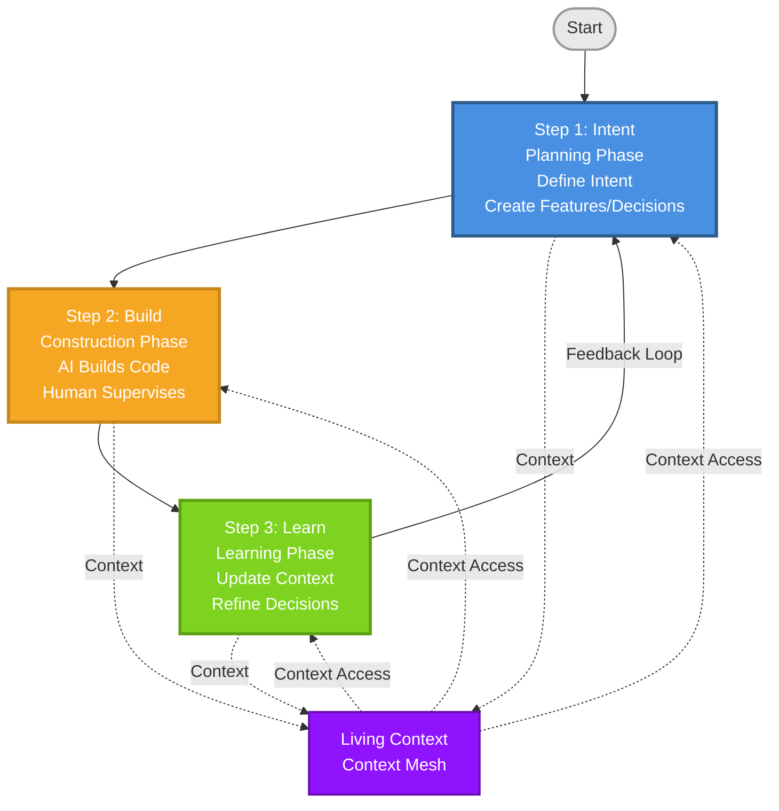
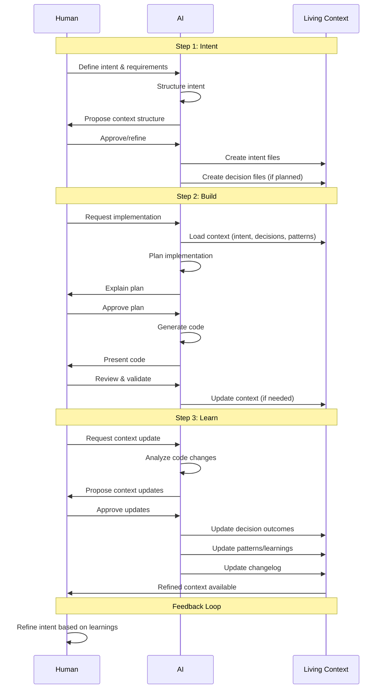

# Context Mesh - Framework Structure

> 📘 **Complete Reference** - This is the full framework documentation.
> For a quick start, see [GETTING_STARTED.md](GETTING_STARTED.md).

---

## Framework Overview

> **The Problem**: AI-generated code works, but context disappears. Three months later, your own code looks foreign.

**The Solution**: Context Mesh makes context the primary artifact. Code becomes its manifestation, not the other way around.



Context Mesh is a **process framework** for AI-First development that implements the 5 Philosophical Principles of AI-First Development. It treats context as the primary creation, with code as its manifestation, enabling sustainable AI-assisted development.

**The 3 Core Steps:**
1. **Intent** - Define what to build and why (create context)
2. **Build** - AI generates code following your context (human supervises)
3. **Learn** - Update context with learnings (refine and improve)

**Why Context Mesh:**
- ✅ **Context is primary** - AI understands your architecture and patterns
- ✅ **Decisions preserve full context** - Every choice documented with rationale
- ✅ **Knowledge evolves with your system** - Living context that stays current
- ✅ **Works with any methodology** - Integrates with Scrum, Kanban, DevOps, or your own process
- ✅ **Simple to adopt** - Just 3 steps, similar to Scrum's simplicity

**Context Mesh is not a replacement for Scrum or Agile** - it's a complementary framework specifically designed for AI-First development that can be used alongside existing methodologies.

**Customizing Context Mesh**: The framework is designed to be **customizable** while maintaining its core structure. The 3 steps (Intent, Build, Learn) are fixed, but you can adapt how you execute each step to fit your workflow and team needs. Integrates seamlessly with Scrum, Kanban, DevOps, or your own development process.

---

## The 3-Step Context Mesh Workflow

Context Mesh is designed for simplicity and easy adoption, similar to Scrum. The framework consists of three essential steps that preserve context throughout the development lifecycle:

```
┌─────────────┐
│   INTENT    │ ← Define intent + create living context
└──────┬──────┘
       │
       ↓
┌─────────────┐
│    BUILD    │ ← AI builds + human supervises + context evolves
└──────┬──────┘
       │
       ↓
┌─────────────┐
│    LEARN    │ ← Learn + update context + refine intent
└──────┬──────┘
       │
       └──────→ (feedback loop)
                └──────→ INTENT (refined)
```

### How Human and AI Work Together

The following sequence diagram shows the interaction between Human, AI, and Living Context throughout the 3-step workflow:



---

### Step 1: Intent

**Purpose**: Plan and prepare context before building. This is the **planning phase** where you define what to build, create feature intents, make technical decisions, and prepare everything needed for efficient Build phase.

**What it does**: Defines what you want to build and why, creates feature/bug/refactoring intents, makes technical decisions (recommended to plan here), creates initial living context, and identifies or defines initial patterns.

**Intent can be Initial** (quick start: basic intent, refine as you learn) or **Refined** (pre-planned: detailed intent after team discussion). Both approaches are valid.

**Activities**:
- **Define Intent**: Create `project-intent.md`, `feature-*.md`, `bug-*.md`, or `refactor-*.md`. Can start minimal (e.g., "Weather application") and use AI to expand and structure intent.
- **Create Decisions** (recommended in Step 1): Create `decisions/*.md` files for significant technical choices. Best practice: plan decisions before Build for faster implementation. Decisions can be created in any step, but planning in Step 1 makes Build more efficient.
- **Create Initial Context**: AI can help generate context structure. Review and refine AI-generated context using Plan, Approve, Execute pattern.
- **Identify or Define Initial Patterns**: For existing projects, identify existing patterns in codebase. For new projects, define initial patterns based on team experience. Store in `context/knowledge/patterns/`.
- **Align Stakeholders**: Ensure everyone understands the intent and validate decisions with team if needed.

**Human Role**: Lead intent capture, validate intent clarity, approve initial context.

**AI Role**: Assist in structuring intent, suggest context organization, analyze similar projects for insights, generate context from prompts, explain what it will create before executing (Plan, Approve, Execute).

**Outputs**: Clear Intent Statement, Technical Decisions (if planned), Initial Living Context, Initial Patterns (if identified or defined).

**Principles Applied**: ✅ Context as Primary Creation - Context is created first | ✅ Intent-Driven Architecture - Intent guides everything

---

### Step 2: Build

**Purpose**: **Construction phase** - AI builds code with context, human supervises, and decisions are documented or updated as needed.

**Prerequisites** (from Step 1): Intent Statement (Required), Technical Decisions/ADR (Required before implementation), Initial patterns (Optional).

**Critical Requirement - ADR Before Implementation**: Before implementing any feature, **verify if a technical decision (ADR) exists** for the approach needed. If no decision exists, **create the decision first** in Step 1 (Intent) or at the start of Step 2 (Build) before proceeding. **Do not start implementation without a documented decision**. Feature implementation must follow project-level Definition of Done (DoD) and meet Acceptance Criteria.

**Note**: Decisions can be created or updated in any step. Step 1 (Intent) is recommended for faster Build. Step 2 (Build): Create decision first if missing, then implement. Step 3 (Learn): Update decisions with outcomes.

**What it does**: AI generates code using living context (intent, decisions, patterns/anti-patterns), human supervises and validates, decisions are created or updated, context is continuously updated, follows established patterns, avoids known anti-patterns.

**Activities**:
- **Verify Decision (ADR) exists**: Check if technical decision exists. If not, create it first (must document: Context, Decision, Rationale, Alternatives). Only proceed after decision is documented.
- **Plan before building**: Load necessary context files (intent, decisions, patterns), verify ADR is available, ask AI to explain what it will build and how, review AI's planning approach.
- **Approve before executing**: Review and approve plan (or request changes), ensure ADR is in place, AI executes only with your approval.
- **Execute with context**: AI generates code based on approved plan and documented decisions, follow DoD for feature implementation, human supervises and validates.
- **Create or update decisions**: Use decisions from Step 1 if they exist, create new decisions if technical choices emerge, update existing decisions if approach differs from plan.
- **Follow patterns**: Use established patterns from knowledge/, avoid known anti-patterns, identify new patterns during implementation (optional), update context continuously, review code quality, validate against intent and DoD.

### Writing Prompts for AI Code Generation

**Context Mesh Philosophy**: Since **context is the primary artifact**, prompts should be **simple and reference the context**. The context files contain all the details (tech stack, patterns, anti-patterns, requirements, decisions).

**Approach Hierarchy** (in order of recommendation):

1. **✅ Simple Prompts (Recommended - Default)**: Use when context is sufficient. Example: `Implement authentication following @context/intent/feature-user-auth.md and @context/decisions/002-auth-approach.md`. Advantages: Context is primary, less maintenance, single source of truth, more reliable.

2. **✅ AI Agents (agent-*.md) (Advanced - When Needed)**: Use when you need structured/reusable execution or working with a team. Example: `Execute @context/agents/agent-backend.md for payment feature`. See [ADVANCED.md](ADVANCED.md) for details.

3. **⚠️ Detailed Prompts (Avoid - Temporary Only)**: Use only temporarily for testing or learning. Duplicates information from context, hard to maintain. If needed frequently, create an `agent-*.md` file instead.

**Decision Guide**: Simple project → Simple Prompts | Complex project/Team → AI Agents | Temporary test → Detailed Prompt (acceptable, but temporary).

**Recommendation**: Start with Simple Prompts (default). Add AI Agents when you need structure or reusability. Avoid Detailed Prompts - use only temporarily, or create an agent file. Remember: Context is primary.

**Context Artifacts**:
- Implementation Code (with context links)
- Decision Records (why decisions were made)
- Build Context Updates
- Code-Context Mapping

**Human Role**:
- Supervise AI execution
- Validate code quality
- Approve implementation decisions
- Review context updates
- Make critical decisions

**AI Role**:
- Explain planning approach before generating code
- Generate code based on context (after approval)
- Suggest technical solutions
- Review code for context alignment
- Propose improvements

**Outputs**:
- Implemented Code (context-linked)
- Decision Records
- Updated Living Context
- Implementation Documentation
- New Patterns Identified (optional)

**Principles Applied**:
- ✅ **Human-AI Collaborative Consciousness** - Explicit collaboration
- ✅ **Contextual Decision Architecture** - Decisions with context
- ✅ **Knowledge as Living Entity** - Context evolves continuously

---

### Step 3: Learn

**Purpose**: **Learning phase** - Update living context to reflect code changes, document learnings, and refine decisions and intent based on outcomes.

**What it does**: Updates context to reflect actual code changes, documents learnings, updates decisions with outcomes, creates or updates improvement decisions if needed, refines intent if needed, creates feedback loop to Intent.

**Activities**:
1. **Update Context** (Primary): Plan (ask AI to identify what changed), Approve (review AI's analysis), Execute (update context with approval). Update context to match current codebase, update decision records with outcomes, create new improvement decisions if learnings suggest better approaches, update changelog.
2. **Preserve Knowledge** (Important): Preserve patterns identified during Build, update patterns based on learnings, document new anti-patterns discovered, preserve context around patterns/anti-patterns.
3. **Document Learnings** (Optional): Note what worked well, document challenges or discoveries.
4. **Refine Intent** (If needed): Adjust intent based on learnings, create new work items if needed. **Feedback Loop**: Learnings from Step 3 feed back to Step 1 (Intent) for refinement in the next cycle.

**Human Role**: Review code changes, decide what needs context updates, update context (with AI assistance), validate context accuracy.

**AI Role**: Explain what changed before updating context (Plan, Approve, Execute), help identify what changed in code, suggest what needs updating in context, assist in updating documentation, propose context improvements.

**Outputs**: Updated Living Context, Updated Decision Records (with outcomes), Updated Changelog, Preserved/Updated Patterns, Learning Notes (optional), Refined Intent (if needed).

**Principles Applied**: ✅ Knowledge as Living Entity - Knowledge evolves | ✅ Context as Primary Creation - Context is updated | ✅ Intent-Driven Architecture - Intent is refined

---

## Context Structure

Now that you understand the 3-step workflow, let's explore how context is organized and structured.

Context Mesh uses a simple directory structure to organize context:

```
context/
├── intent/          # Step 1: Intent statements
│   ├── project-intent.md
│   ├── feature-*.md
│   ├── bug-*.md
│   └── refactor-*.md
│
├── decisions/       # Decisions (can be created in any step, recommended in Step 1)
│   └── 001-*.md, 002-*.md, ...
│
├── knowledge/       # Patterns, anti-patterns (all steps)
│   ├── patterns/
│   └── anti-patterns/
│
├── agents/          # Reusable execution patterns (optional)
│   └── agent-*.md
│
└── evolution/       # Step 3: Changelogs, learnings
    ├── changelog.md
    └── learning-*.md
```

**Why this structure:**
- Simple and clear organization
- Easy to navigate and maintain
- Works with any tools (or no tools)
- Flexible - add subdirectories as needed

**Living Context**: This structure creates a **living knowledge repository** that stores intent, decisions, implementation details, learnings, patterns, and anti-patterns. It evolves continuously as the system changes, maintains full traceability from intent to code to outcomes, and preserves patterns with their context. Context is versioned (using Git), searchable, and always up-to-date.

---

## Using AI as Your Assistant

Context Mesh works with AI tools (Cursor, GitHub Copilot, etc.) as assistants:

- **Step 1 (Intent)**: Use AI to help structure and refine your intent
- **Step 2 (Build)**: Use AI to generate code based on your context
- **Step 3 (Learn)**: Use AI to help identify changes and update context

You maintain control - AI assists, you decide.

---

## AI-Human Collaboration

**Collaboration Pattern**: **Intent** - Human leads, AI assists | **Build** - AI builds, human supervises | **Learn** - AI analyzes, human validates.

**Human Responsibilities**: Lead intent capture and validation, supervise AI execution, review and approve work, validate learnings and insights, make critical decisions.

**AI Responsibilities**: Generate code based on context, suggest solutions and improvements, review code for quality, help identify what needs updating in context, propose context updates.

**Plan, Approve, Execute Pattern**: Context Mesh uses this pattern for all AI-assisted work. 1) **Plan** - AI explains what it will do (context creation, code generation, or updates). 2) **Approve** - You review and approve (or request changes), maintain control over execution. 3) **Execute** - AI executes only with your approval. This pattern applies to context creation/updates (Step 1, Step 3), code generation (Step 2), and any AI-assisted task. **Why it matters**: You maintain control, AI explains before acting, you can refine before execution, reduces rework and improves quality.

---

## Definition of Done (DoD)

Context Mesh uses **Definition of Done** at the **technical/feature level only** - criteria that every feature implementation must meet before being considered complete. DoD applies to **Step 2 (Build)** where technical implementation happens, not to Step 1 (Intent) or Step 3 (Learn).

**Key Points:**
- **DoD is technical only**: Applied during Step 2 (Build) when code is implemented
- **Steps 1 and 3 don't have DoD**: They have flexible "Outputs" instead, as they are more iterative and adaptive
- **Project-level DoD**: Defined by your team/project, not by Context Mesh. Context Mesh adds the requirement to update context as part of your DoD
- **When to apply**: Only when implementing features (Step 2), not during planning (Step 1) or learning (Step 3)

**Typical DoD Criteria** (for Step 2 - Build):
- Code implemented and working
- Tests passing
- Code review completed
- **Context updated** (Context Mesh requirement)
- Documentation updated
- Deployed (if applicable)

**Acceptance Criteria vs DoD:**
- **Acceptance Criteria** (in `feature-*.md` files) - What the feature needs to do functionally (e.g., "User can login", "Data is saved")
- **Definition of Done** = Process criteria that must be met during implementation (e.g., "Tests passing", "Code reviewed", "Context updated")

**Why DoD is only for Step 2 (Build):**
- **Step 1 (Intent)**: More flexible - can be Initial or Refined. Has "Outputs" (Intent Statement, Decisions, Initial Context) but no rigid DoD
- **Step 2 (Build)**: Technical implementation - needs objective criteria (tests, code quality, etc.) - **DoD applies here**
- **Step 3 (Learn)**: Iterative and adaptive - has "Outputs" (Updated Context, Learnings) but no rigid DoD

This keeps Context Mesh flexible while ensuring technical quality where it matters most.

---

## Working with Features, Bugs, and Refactoring

With the fundamentals in place, here's how to apply Context Mesh to different types of work.

Context Mesh applies to **any type of work**. All follow the same 3-step pattern:
- **New Feature**: Step 1: Define feature intent → Step 2: Build with context → Step 3: Learn and update context
- **Bug Fix**: Step 1: Define fix intent → Step 2: Fix bug, document decision → Step 3: Learn, update context
- **Refactoring**: Step 1: Define refactoring intent → Step 2: Refactor, document decisions → Step 3: Learn, preserve patterns

---

## Project Intent vs Features, Bugs, and Refactoring

Understanding when to use `project-intent.md` versus individual feature/bug files is crucial for maintaining clear context organization.

**Project Intent (`project-intent.md`)**: Defines overall project scope, goals, and high-level objectives. Use for project vision, high-level goals, general scope (not individual features), project-wide principles, strategic direction. **Update when**: Project scope changes significantly, high-level goals change, strategic direction changes. **Do NOT update for**: Adding individual features (create `feature-*.md`), fixing bugs (create `bug-*.md`), updating existing features (update `feature-*.md`), technical decisions (create `decisions/*.md`).

**Features (`feature-*.md`)**: Defines individual feature requirements, goals, and acceptance criteria. Create when starting a new feature (each feature gets its own file). Update when refining requirements, adding functionality, changing scope. Deprecate (do NOT delete) when feature is removed/replaced - mark as deprecated but keep file for history.

**Bugs (`bug-*.md`)**: Defines bug description, impact, and fix requirements. Create when starting a bug fix (each bug gets its own file). Update when refining bug understanding, adding root cause analysis. Deprecate (do NOT delete) when bug is fixed - mark as resolved but keep file for history.

**Practical Workflow**: New Feature → Create `feature-*.md` (Step 1), implement (Step 2), update with learnings (Step 3). Update Existing Feature → Update existing `feature-*.md` (do NOT create new file). Bug Fix → Create `bug-*.md` (Step 1), fix bug (Step 2), mark as resolved (Step 3). Change Project Scope → Update `project-intent.md` (exception), create new `feature-*.md` files for new major areas.

**Quick Reference Table**:

| Situation | File to Create/Update | Action |
|----------|----------------------|--------|
| New Feature | `feature-*.md` | Create new file |
| Update Feature | `feature-*.md` (existing) | Update existing file |
| Deprecate Feature | `feature-*.md` (existing) | Mark as deprecated, keep file |
| Bug Fix | `bug-*.md` | Create new file |
| Update Bug Understanding | `bug-*.md` (existing) | Update existing file |
| Resolve Bug | `bug-*.md` (existing) | Mark as resolved, keep file |
| Change Project Scope | `project-intent.md` | Update (only for scope changes) |
| Technical Decision | `decisions/*.md` | Create new file |

---

## Decision Documentation

Every significant decision should be documented with: **Context** (what was the situation?), **Decision** (what did we decide?), **Rationale** (why did we decide this?), **Alternatives** (what else did we consider?), **Outcomes** (what happened? - updated in Learn step).

**When to Create Decisions**: Decisions can be created in any step, but the framework recommends planning them in Step 1 (Intent) for faster Build phase. **Step 1 (Intent) - Recommended**: Plan technical decisions when you know the approach, create `decisions/*.md` files before Build, best for architectural decisions, technology choices, design patterns. **Step 2 (Build) - Flexible**: Create decisions if technical choices emerge during implementation, update existing decisions if approach differs from plan, best for implementation-level decisions. **Step 3 (Learn) - Outcomes**: Update decisions with outcomes, create improvement decisions if learnings suggest better approaches.

**When to Document**: Architectural decisions, technology choices, design patterns, important implementation choices. **Format**: Simple markdown or structured format in your context repository. See examples in [GETTING_STARTED.md](GETTING_STARTED.md) or [examples/](examples/).

---

## Context File Organization

**File Creation Rules**: Create new file for new scope (new work item → new intent file, new decision → new decision file, new pattern → new knowledge file, important learning → new learning file). Update existing file for same scope (refine intent, add outcomes to decision, update pattern, add changelog entry).

**File Naming Conventions**:
- **Intent Files**: `project-intent.md`, `feature-*.md`, `bug-*.md`, `refactor-*.md`
- **Decision Files**: `001-*.md`, `002-*.md`, ... (sequential numbering)
- **Knowledge Files**: `patterns/*.md`, `anti-patterns/*.md`
- **Evolution Files**: `changelog.md`, `learning-*.md`

**Linking and Traceability**: All files should link to related files for full traceability. Include a "Related" section linking to intent, decisions, learnings, and patterns. This creates traceability: Intent → Decision → Learning → Pattern.

---

## Status and Dates

Status and dates help track the lifecycle of context files and provide traceability for AI agents and team collaboration.

**Status Section Format** (include at end of every context file):
```markdown
## Status
- **Created**: YYYY-MM-DD (Phase: Intent/Build/Learn)
- **Status**: [Status Type]
- **Updated**: YYYY-MM-DD (Phase: Intent/Build/Learn) - [reason] (optional)
```

**Status Types**:
- **Intent Files**: Draft, In Progress, Completed, Deprecated, Resolved
- **Decision Files**: Proposed, Accepted, Superseded, Deprecated
- **Knowledge Files**: Active, Deprecated, Superseded
- **Learning Files**: Active, Archived

**Best Practices**: Always include created date, update status when it changes, add updated date for significant changes, include phase (which Context Mesh step), be consistent across all files.

---

## Patterns & Anti-patterns

Patterns and anti-patterns are knowledge that evolves with the system and guide development.

**When Patterns are Established**:
- **For New Projects** (Step 1: Intent): Define initial patterns based on team experience or best practices. Start with minimal set, evolve as you learn.
- **For Existing Projects** (Step 1: Intent): Identify existing patterns in the codebase, document patterns that are working well, identify anti-patterns that should be avoided.
- **During Build** (Step 2): Use established patterns from knowledge/, follow patterns when implementing, avoid known anti-patterns, optionally identify new patterns during implementation.
- **During Learn** (Step 3): Preserve patterns identified during Build, update patterns based on learnings, document new anti-patterns discovered, refine pattern context based on outcomes.

**Pattern Documentation**: **Pattern** - What it is, when to use it, why it works, examples. **Anti-pattern** - What to avoid, why it's problematic, what problems it causes. Both include context and link to decisions and learnings.

---

## Avoiding Overdocumentation

**Key Principle**: Use Git for versioning. Create new files only for new scopes.

### When to Create New File

Create a new file when you have a **new scope**:
- ✅ New work item (feature, bug, refactoring) → new intent file
- ✅ New significant decision → new decision file  
- ✅ New pattern/anti-pattern discovered → new knowledge file
- ✅ Important learning that affects future decisions → new learning file

### When to Update Existing File

Update existing file when it's the **same scope** (Git will version it):
- ✅ Refine intent → update intent file
- ✅ Add outcomes to decision → update decision file
- ✅ Evolve pattern with learnings → update pattern file
- ✅ Add changelog entry → update changelog.md
- ✅ Minor corrections, clarifications → update file

### Rule of Thumb

**Ask yourself**: "Is this a new scope or evolution of existing scope?"

- **New scope** → Create new file
- **Same scope** → Update file (Git preserves history)

### Examples

**✅ Good - Update existing:**
- Refining `feature-dark-mode.md` → Update the file (Git shows history)
- Adding outcomes to `001-jwt-authentication.md` → Update the file
- Evolving `jwt-auth-pattern.md` → Update the file

**✅ Good - Create new:**
- New feature "notifications" → Create `feature-notifications.md`
- New bug fix → Create `bug-login-timeout.md`
- New pattern discovered → Create new pattern file

**❌ Avoid - Overdocumentation:**
- Creating `feature-dark-mode-v2.md` when refining → Just update original
- Creating `001-jwt-outcomes.md` → Just add outcomes to original
- Creating pattern version files → Just update original pattern

**Deprecating (NOT Removing):**
- When a feature is removed or replaced → Mark as deprecated in the file, do NOT delete
- When a bug is resolved → Mark as resolved in the file, do NOT delete
- Keep files for history and traceability
- Git preserves all history, so deprecated files remain accessible

**Remember**: Git is your version control. Use it. Create files only for new scopes. Deprecate, don't delete.

---

## AGENTS.md Integration

For teams and advanced use cases, Context Mesh integrates with additional tools and standards.

Context Mesh works seamlessly with the **[AGENTS.md](https://agents.md/)** standard, an open format used by over 20,000 open-source projects to guide AI coding agents.

**AGENTS.md** acts as a **router** that directs AI agents to Context Mesh files. Keep it **succinct** - it should primarily indicate where to find context, not duplicate it:

- **AGENTS.md** = Operational router (setup commands, workflow, references to Context Mesh files)
- **Context Mesh** = Strategic context (intent, decisions, knowledge, patterns)

**Together**: AGENTS.md routes AI agents to the right Context Mesh files, providing both operational guidance and strategic context.

**Structure**: `AGENTS.md` at project root references `context/` directory. Your `AGENTS.md` should include a "Context Files to Load" section listing relevant context files (e.g., `@context/intent/project-intent.md`, `@context/decisions/001-tech-stack.md`).

**Important**: AGENTS.md should be **kept updated** to reflect changes in the living context. When context files are added, updated, or removed, update AGENTS.md accordingly:
- New feature intents → Add to "Feature-Specific Context" section
- New decisions → Add to "Technical Decisions" section
- New patterns → Add to "Knowledge and Patterns" section
- Deprecated features → Update or remove references

**Note**: AGENTS.md is **optional** but **recommended** for better AI agent experience. Context Mesh works perfectly without it, but together they provide complete guidance.

See [TOOLS.md](TOOLS.md) for more details on AGENTS.md integration.

---

## Agents (agent-*.md)

Agents are simple reusable execution patterns stored in `context/agents/`. They're markdown files that define how to execute specific tasks by referencing Context Mesh files (intent, decisions, patterns) and providing step-by-step execution instructions.

**Key principle**: Agents should **reference** context, not duplicate it. All details are in context files - agents just tell AI how to execute.

**When to create an agent:**
- ✅ You find yourself writing the same detailed prompt repeatedly
- ✅ You want to standardize how certain tasks are done
- ✅ You're working with a team and want shared execution patterns
- ✅ You have a complex task that needs structured steps

**Don't create an agent when:**
- ❌ Simple prompts work fine (just reference context files)
- ❌ The task is one-time only
- ❌ Context files already have all the information needed

**Simple Agent Format:**
```markdown
# Agent: [Agent Name]
## Purpose
[What this agent does - one sentence]
## Context Files to Load
- @context/intent/feature-[name].md
- @context/decisions/[number]-[name].md
- @context/knowledge/patterns/[pattern].md
## Execution Steps
1. Load context files listed above
2. [Step 1 - what to do]
3. [Step 2 - what to do]
## Output
- [What this agent produces]
```

**Using agents**: Reference in your prompt: `Execute @context/agents/agent-[name].md for [feature]`. The AI will read the agent file, load referenced context files, follow execution steps, and produce outputs.

**Creating agents**: Create manually in `context/agents/` or use the `create-agent.md` prompt (see [prompts/](prompts/)). Keep agents simple - they're just reusable prompts that reference your context.

**For advanced agent patterns** (specialized agents, team collaboration, complex workflows), see [ADVANCED.md](ADVANCED.md) for detailed agent structures, standard agent types (Planner, Developer, Reviewer, DevOps, Insights), and advanced execution patterns.

---

## Practical Flexibility

Context Mesh adapts to your needs and workflow. Different approaches are equally valid:

**Starting Points**:
- **Minimal Start**: Start with basic intent (e.g., "Weather application"), use AI with prompts to expand context, more iterative, learn as you go. Works well for exploratory projects, learning as you go, quick prototypes, when requirements are unclear.
- **Comprehensive Start**: Include decisions, patterns, DevOps planning in Step 1, create complete context before Build, faster Build phase. Works well for large projects, clear requirements, team projects. (Note: DoD is defined at project level and applied during Step 2 - Build, not in Step 1)
- **Existing Projects**: Use AI to analyze existing code, generate context from codebase, AI identifies patterns/decisions/architecture, then follow normal workflow. Works well for legacy codebases, taking over projects, refactoring initiatives.

**AI-Assisted Workflow**: Use prompts like "Create context for [project description]", "Generate decisions for [feature]", "Update context based on [changes]". Use selective context loading (load only necessary files per task) for faster AI processing and more focused results. Feature-by-feature approach: Complete Step 1 for all features, refine all intents before Build, build feature by feature, learn after each feature.

All approaches are valid - choose based on your needs.

---

## Security by Design

Security in Context Mesh is built into the framework from the ground up. Essential security principles:

**Security Principles**:
1. **Security by Design**: Security considered at every step (requirements in Step 1, considerations in Step 2, monitoring in Step 3)
2. **Context Security**: Living Context contains sensitive information - requires access controls, encryption for sensitive context, context classification (public, internal, confidential, secret), version control (Git)
3. **Traceability**: All security-relevant actions must be traceable - context changes tracked (Git), security decisions documented, deployments recorded
4. **Least Privilege**: Access to context and systems follows principle of least privilege - minimum necessary permissions, regular access reviews, least privilege for AI tools
5. **Defense in Depth**: Multiple layers of security protection (network, application, data, access control, monitoring)

**Security in Each Step**: **Step 1 (Intent)** - Identify security requirements, document security constraints, define security acceptance criteria, classify context sensitivity. **Step 2 (Build)** - Implement security controls, follow security best practices, document security decisions, review code for security issues. **Step 3 (Learn)** - Monitor security metrics, review security incidents, update security practices, refine security requirements.

**Security Best Practices**: Start with security from the beginning, document security decisions, regular reviews, keep context secure, monitor continuously in production.

---

## Framework Principles Alignment

1. **Context as Primary Creation**: Every step creates/updates context
2. **Intent-Driven Architecture**: Architecture flows from intent (Step 1 → Step 2)
3. **Knowledge as Living Entity**: Context evolves continuously (all steps)
4. **Human-AI Collaborative Consciousness**: Clear human-AI roles in each step
5. **Contextual Decision Architecture**: Decisions captured with full context

---

## Integration with Scrum/Agile

Context Mesh can be integrated with Scrum:

- **Sprint Planning**: Use Step 1 (Intent) for each item
- **During Sprint**: Use Step 2 (Build)
- **Sprint Review**: Use Step 3 (Learn)
- **Retrospective**: Refine context and intent

Context Mesh adds:
- Context preservation throughout
- AI agent integration
- Intent-driven development
- Living knowledge evolution
- Decision architecture

---

## Getting Started

1. **Start with Intent**: Define what you want to build and why
2. **Build with Context**: Use AI with full context, supervise and document
3. **Learn and Update**: Update context to reflect code changes, document learnings

See [GETTING_STARTED.md](GETTING_STARTED.md) for detailed implementation guide.

## Advanced Patterns

For larger projects or teams, Context Mesh offers advanced patterns:

- **AI Agents Structure**: Organize execution patterns with agent definitions
- **Modular Workflows**: Execute specific parts of the build process
- **Team Collaboration**: Share agents and context across team members

See [ADVANCED.md](ADVANCED.md) for advanced patterns and extensions.

**Note**: Advanced patterns are **optional**. Start with basic Context Mesh, add complexity only when needed.
