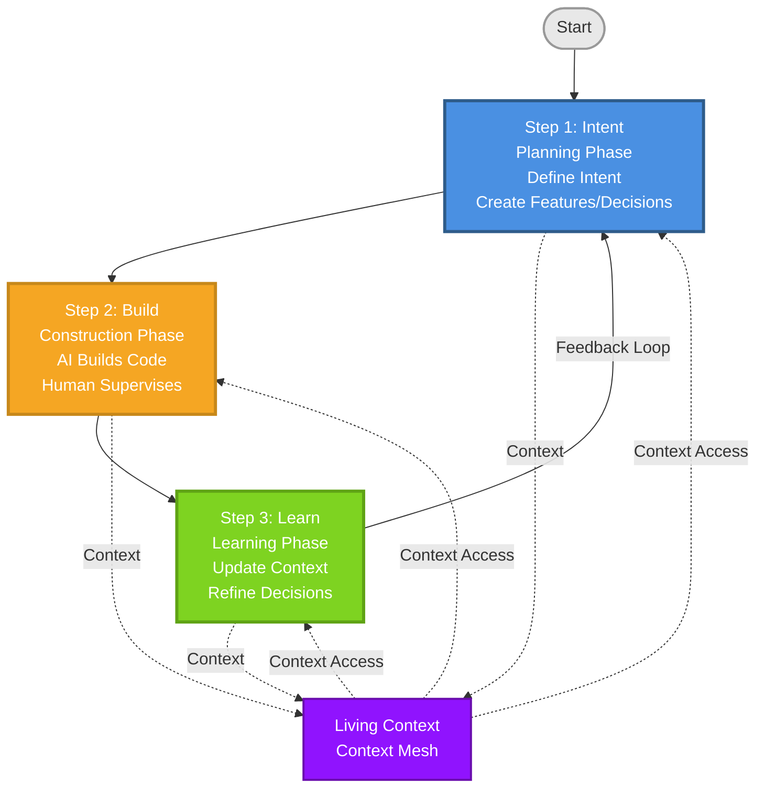

<div align="center">

<!--  -->
<a href="#">
<h1>Context Mesh</h1></a>

**The AI-First Development Framework for Sustainable Context Preservation**

[](https://github.com/your-username/context-mesh/releases)
[](https://github.com/your-username/context-mesh)
[](https://github.com/your-username/context-mesh)
[](https://github.com/your-username/context-mesh)

> "In the AI era, context isn't supplementary to code—it's the primary creation. Context Mesh makes this philosophy practical."

[The Problem](#-the-problem-context-crisis) • [What is Context Mesh?](#-what-is-context-mesh) • [The 3-Step Workflow](#-the-3-step-context-mesh-workflow) • [Quick Start](#-quick-start)

</div>

## 🚨 The Problem: Context Crisis

You're using AI to build faster. You prompt, AI generates, code works. You ship features in days instead of weeks. Everything seems perfect.

But three months later, you open that codebase and it looks foreign. Why did we choose this approach? What was the reasoning behind that decision? Why does this pattern exist here but not there? The context is gone. The decisions are forgotten. The rationale is lost.

You spend hours reconstructing what you already knew. Your team struggles to understand code that was clear when it was written. New developers take weeks to onboard instead of days. Every change feels risky because you're working blind.

**The Reality:**
- **70% of developers** struggle with understanding existing code ([Stack Overflow 2023](https://survey.stackoverflow.co/2023/))
- **32% of developer time** wasted reconstructing lost context ([McKinsey Research](https://www.mckinsey.com/industries/technology-media-and-telecommunications/our-insights/yes-you-can-measure-software-developer-productivity))
- **AI-generated code works**, but becomes impossible to maintain and scale

**This isn't just documentation** - it's a fundamental process problem. Context Mesh fixes it by making context the primary artifact. Code becomes its manifestation, not the other way around.

---

## 🎯 What is Context Mesh?

Context Mesh is a **process framework** for AI-generated code development with **3 core steps** (Intent, Build, Learn) that can be customized to fit your workflow. It's not about using AI—it's about making AI-generated code maintainable and scalable through structured context preservation.

**Framework Structure:**
- **3 Core Steps**: Intent → Build → Learn (the foundation)
- **Customizable**: Adapt the process to maximize the benefits of Context Mesh for your team and project
- **Flexible**: Works with any development methodology (Scrum, Kanban, DevOps)

**Key Difference:**
- ❌ **Just using AI**: Fast development, but context disappears
- ✅ **Context Mesh**: Fast development WITH context preservation

**Context Mesh is NOT a replacement for Scrum or Agile** - it's a complementary framework specifically designed for AI-First development that works alongside existing methodologies like Scrum, Kanban, or DevOps.

---

## 📋 The 3-Step Context Mesh Workflow

Here's how it works in practice. Context Mesh is designed for simplicity and easy adoption, similar to Scrum. Just **3 simple steps**:



1. **🎯 Intent** - Define what to build and why (create context)
   - Plan what to build and why
   - Create feature intents, technical decisions
   - Prepare context for efficient building

2. **🔨 Build** - AI generates code following your context
   - AI generates code following your context
   - Human supervises and validates
   - Decisions documented as you build

3. **📚 Learn** - Update context with learnings
   - Update context to reflect actual code
   - Document learnings and outcomes
   - Refine intent for next iteration

**Each step preserves context** - no more lost decisions or forgotten rationale.

### Customizing Context Mesh

Context Mesh is a **process framework** with 3 core steps, but it's designed to be **customizable**. You can adapt it to maximize the benefits for your team and project:

- **Core is fixed**: The 3 steps (Intent, Build, Learn) are the foundation
- **Process is flexible**: Adapt how you execute each step to fit your workflow
- **Customize to maximize value**: Adjust the process to get the best results from Context Mesh
- **Works with any methodology**: Integrates with Scrum, Kanban, DevOps, or your own process

The framework provides structure while allowing you to customize the implementation to fit your needs.

See [FRAMEWORK.md](FRAMEWORK.md) for complete details.

---

## 🚀 Why Context Mesh?

### The Inversion

```
Traditional: Code → Documentation (often incomplete)
Context Mesh: Context → Code (always complete)
```

Traditional development treats code as primary and documentation as secondary. **AI-First Development inverts this paradigm**:

| Traditional | Context Mesh |
|------------|--------------|
| Code is primary | **Context is primary** |
| Documentation is secondary | **Code is manifestation of context** |
| Knowledge is static | **Knowledge evolves with system** |
| Decisions lose context | **Decisions preserve full context** |
| Human-AI friction | **Seamless human-AI collaboration** |

### What This Means for You

When context is primary:
- ✅ AI understands your architecture and patterns
- ✅ Code generation follows your decisions
- ✅ Code remains comprehensible months later
- ✅ New developers onboard in days, not weeks
- ✅ Changes are made with full context

---

## ✅ Real-World Results

✅ **10 days** for complete monolith-to-micro-frontends migration (typically takes months) - 2 developers using Context Mesh

[See more success stories →](EXAMPLES.md#-success-stories)

---

## 🎯 Key Features

- 🧬 **Living Context** - Context evolves with your code, versioned like code
- 🤝 **AI-Human Collaboration** - Clear roles, seamless workflow
- 🎯 **Intent-Driven** - Architecture flows from purpose, not implementation
- 📝 **Decision Preservation** - Every decision with full context and rationale
- 🔗 **Works with Scrum/Agile** - Complementary, not replacement

---

## 🚀 Quick Start

Ready to fix the Context Crisis? Get started now:

### ⚡ Fastest Path (2 minutes)

**Don't want to create the structure manually?** Use AI to bootstrap it:

1. **📋 Choose a prompt** from [prompts/](prompts/) based on your scenario
2. **📝 Copy the prompt** from the prompt file
3. **🤖 Use AI** (Cursor, Copilot, Claude) to generate the complete Context Mesh structure
4. **✅ Review** and refine the generated files

**That's it!** You're ready to use Context Mesh.

[👉 See Prompt Templates →](prompts/README.md)

### 📚 Complete Path (30 minutes)

Want to understand everything first? Follow this path:

1. **📘 Read** [FRAMEWORK.md](FRAMEWORK.md) - Understand the 3-step workflow ⏱️ 15 min
2. **🚀 Follow** [GETTING_STARTED.md](GETTING_STARTED.md) - Hands-on implementation ⏱️ 10 min
3. **📚 See** [examples/](examples/) - Complete end-to-end example ⏱️ 5 min

**✅ After this path, you'll be ready to use Context Mesh in your project!**

[👉 Get Started Now →](GETTING_STARTED.md)

---

## 📚 Next Steps

**Want to understand the philosophy?**
- [PRINCIPLES.md](PRINCIPLES.md) - The 5 AI-First principles explained ⏱️ 15 min

**Want to see it in action?**
- [prompts/](prompts/) - Quick init prompts for different scenarios ⚡ 2 min
- [EXAMPLES.md](EXAMPLES.md) - Real-world examples, use cases, and success stories ⏱️ 10 min
- [examples/](examples/) - Complete end-to-end examples ⏱️ 20 min

**Using Scrum/Agile/DevOps?**
- [INTEGRATION.md](INTEGRATION.md) - Integration with existing workflows ⏱️ 10 min

**Need advanced patterns?**
- [ADVANCED.md](ADVANCED.md) - AI Agents, modular workflows ⏱️ 20 min

**Need help?**
- [FAQ.md](FAQ.md) - Common questions and answers
- [GLOSSARY.md](GLOSSARY.md) - Key terms and concepts
- [COMPARISON.md](COMPARISON.md) - Context Mesh vs other frameworks
- [TOOLS.md](TOOLS.md) - Tooling recommendations (includes AGENTS.md)

---

## 🎓 Quick Reference

| I want to... | Read this |
|--------------|-----------|
| Understand what Context Mesh is | [README.md](README.md) (this file) |
| Initialize quickly with AI | [prompts/](prompts/) - Prompt templates ⚡ |
| Start using it now | [GETTING_STARTED.md](GETTING_STARTED.md) |
| Learn how to use it | [FRAMEWORK.md](FRAMEWORK.md) |
| See examples | [EXAMPLES.md](EXAMPLES.md) or [examples/](examples/) |
| Use with Scrum/Agile | [INTEGRATION.md](INTEGRATION.md) |
| Learn advanced patterns | [ADVANCED.md](ADVANCED.md) |
| Find a term | [GLOSSARY.md](GLOSSARY.md) |
| Get help | [FAQ.md](FAQ.md) |

---

## 🤝 Contributing

Context Mesh is in active development. Contributions, feedback, and use cases are welcome!

## 📄 License

[MIT License](LICENSE) - See LICENSE file for details.

## 👤 Creator

**Context Mesh** was created to solve the Context Crisis in AI-First development.

For questions, feedback, or contributions, please open an issue or discussion on GitHub.

## 🙏 Acknowledgments

Context Mesh is inspired by:
- The 5 Philosophical Principles of AI-First Development
- PaellaDoc framework concepts
- Agile and Scrum methodologies
- DevOps practices
- Context-driven development research

## 📞 Support

- **Documentation**: See the documentation files in this repository
- **Issues**: [GitHub Issues](https://github.com/your-username/context-mesh/issues)
- **Discussions**: [GitHub Discussions](https://github.com/your-username/context-mesh/discussions)

---

<div align="center">

**Ready to fix the Context Crisis?**

**[Get Started →](GETTING_STARTED.md)** • **[See Examples →](examples/)** • **[Read Framework →](FRAMEWORK.md)**

Made with ❤️ for the AI-First development community

</div>
